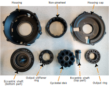

# MSc Thesis - Cost-Effective and Torque-Dense Cycloidal Actuator with Anti-Backlash Mechanisms

Accompaning files for the thesis work "Anti-Backlash Mechanisms for Cost-Effective Cycloidal Drive Robotic Actuators: Design and Evaluation"

Results - Test scripts - CAD source - Step files - Documentation - Diagrams - Photos

## Abstract

3D-printing is a promising method for cost-effective actuator designs, but it often results in less precise tolerances, leading to increased play.
In this work, we propose two novel anti-backlash mechanisms for cycloidal reducers. One uses a conically shaped cycloidal disk, and the other uses a split non-pinwheel design. Both were integrated into a compact actuator design. Two prototypes were manufactured and extensively tested in comparison to a baseline model. Experimental results show that the proposed mechanisms reduce play at the cost of increased friction. Both mechanisms utilize an adjustable preload that can be configured for the intended application based on the trade-off between play and friction.
Furthermore, the designed actuator demonstrates performance that is competitive with recent works. Using 3D-printed components proves to be a viable manufacturing method for cost-efficient designs.

## Actuator design

  
  

## Anti-Backlash mechanism

    
    

## License

Shield: [![CC BY-SA 4.0][cc-by-sa-shield]][cc-by-sa]

This work is licensed under a
[Creative Commons Attribution-ShareAlike 4.0 International License][cc-by-sa].

[![CC BY-SA 4.0][cc-by-sa-image]][cc-by-sa]

[cc-by-sa]: http://creativecommons.org/licenses/by-sa/4.0/
[cc-by-sa-image]: https://licensebuttons.net/l/by-sa/4.0/88x31.png
[cc-by-sa-shield]: https://img.shields.io/badge/License-CC%20BY--SA%204.0-lightgrey.svg
